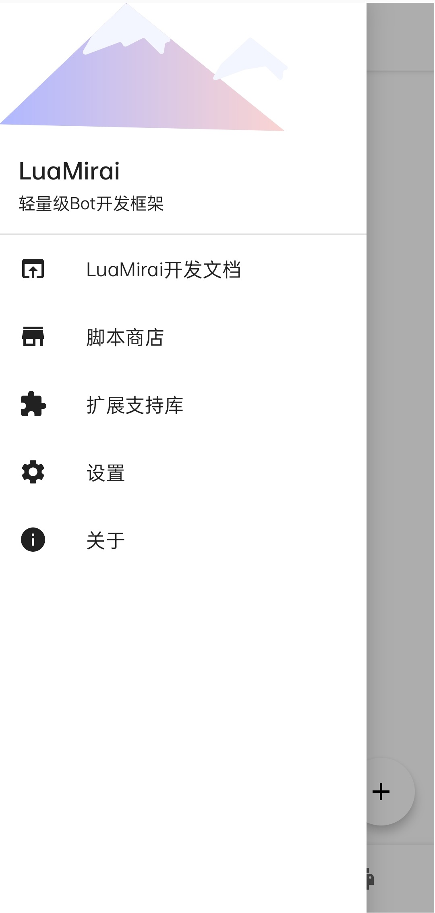

# LuaMirai For Android

[LuaMirai](https://github.com/only52607/lua-mirai)安卓客户端，基于Jetpack Compose构建。

# 下载

## App Center

https://install.appcenter.ms/users/ooooonly/apps/luamirai/distribution_groups/public

# 应用截图

# 主要功能

- [x] 完全可视化的多脚本管理功能

- [x] 强大的多Bot可视化构建及管理界面，对Bot构建参数完全控制

- [x] 可视化日志系统，自定义过滤参数

- [x] 脚本统一下载中心

- [ ] MiraiConsole插件兼容化

# License

[GNU AGPLv3](https://choosealicense.com/licenses/agpl-3.0/)

本项目仅供学习参考，禁止用于任何商业用途。任何单位或个人认为本项目可能涉嫌侵犯其合法权益，应该及时提出反馈，我们将会第一时间对违规内容给予删除等相关处理。